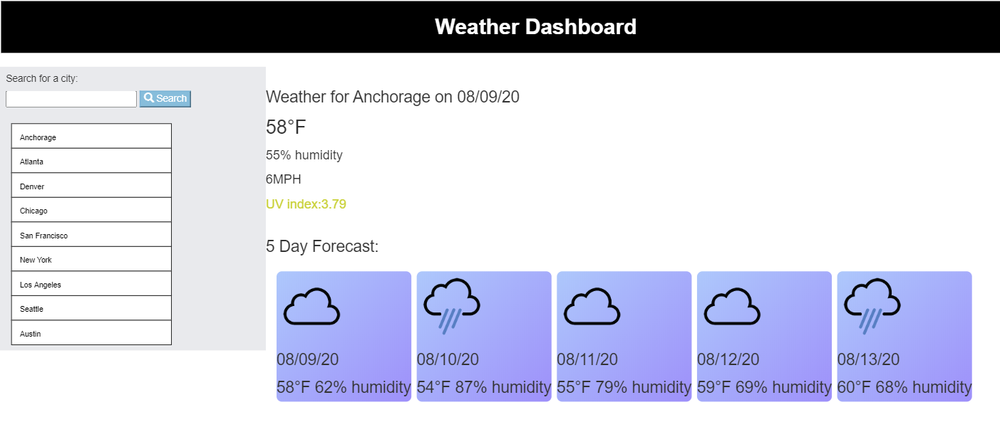

This is a simple weather forcast generator utilizing the [OpenWeather API](https://openweathermap.org/api). There are a few popular buttons already provided, and recent search history will also create a button in the list. Jquery, bootstrap and CSS were utilized. 

 https://joannatanveer.github.io/OpenWeather/

